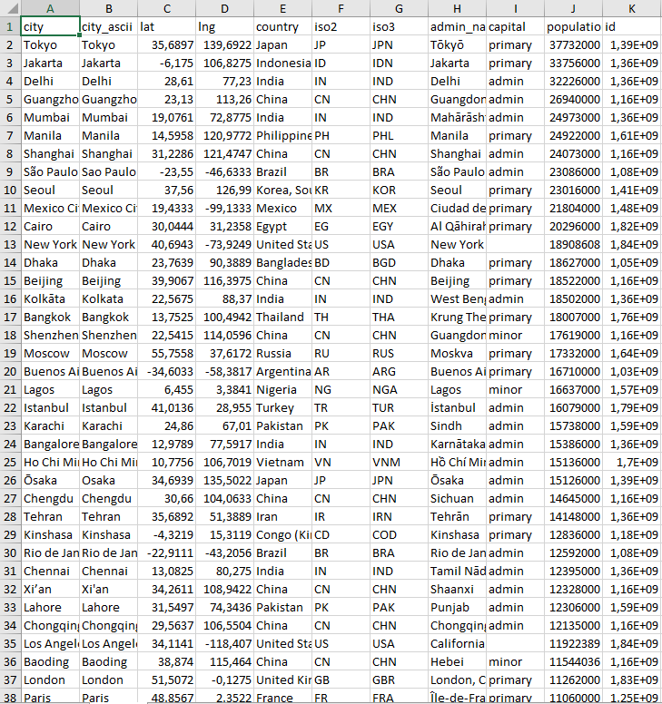
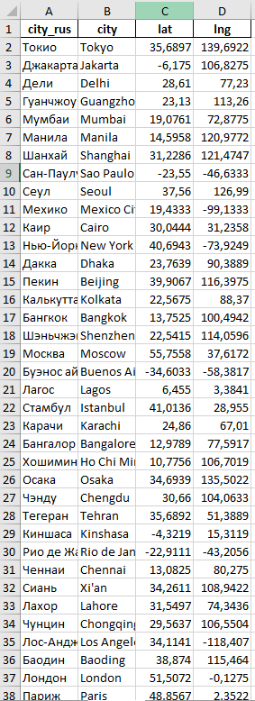
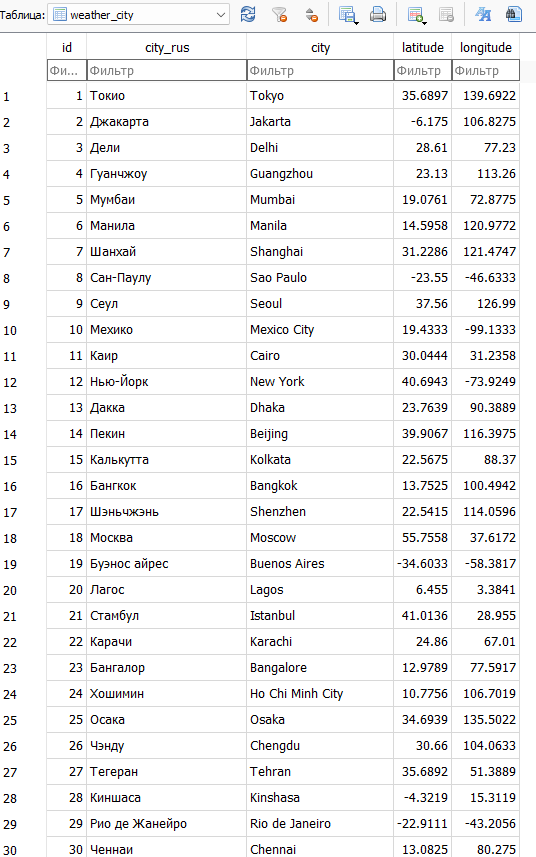
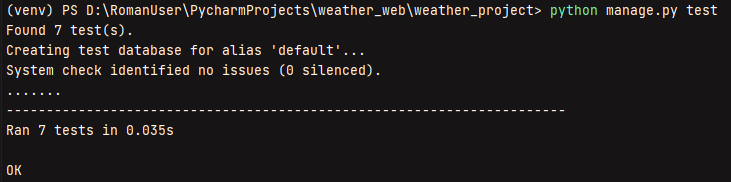
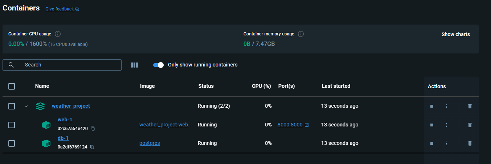

# Weather App


## Описание
Тестовое задание на вакансию Python Developer.

Сделать web приложение, оно же сайт, где пользователь вводит название города, и получает прогноз погоды в этом городе на ближайшее время.
- Вывод данных (прогноза погоды) должен быть в удобно читаемом формате. 
- Веб фреймворк можно использовать любой.
- api для погоды: https://open-meteo.com/ (можно использовать какое-нибудь другое, если вам удобнее)

## Дополнительные задания

- написаны тесты. ✅
- всё это помещено в докер контейнер. ✅
- сделаны автодополнение (подсказки) при вводе города. ✅
- при повторном посещении сайта будет предложено посмотреть погоду в городе, в котором пользователь уже смотрел ранее. ✅
- будет сохраняться история поиска для каждого пользователя, и будет API, показывающее сколько раз вводили какой город. ❌
  
## Функциональность

- Получение текущей погоды
- Прогноз погоды на 7 дней
- Автодополнение при вводе названия города
- История последних запросов с возможностью очистки

## Технологии

- Python 
- Django
- HTML
- CSS
- JavaScript (jQuery)
- Open Meteo API

## Установка и запуск

### Клонирование репозитория

```bash
git clone https://github.com/RomanRizers/weather_app.git
cd weather_app
```
## Реализация поиска прогноза погоды

Так как Open Meteo API, поддерживает только поиск по долготе и широте, то нужно найти датасет, в котором будут находиться координаты городов мира.
Датасет нашел на сайте: https://simplemaps.com/data/world-cities (бесплатно можно скачать датасет  с количеством около 47000 городов, что для тестового задания вполне достаточно).
Чтобы пользователь мог вводить название городов, как на русском, так и на английсокм, нужно сделать еще одну колонку, уже с русским названием городов. 

Написал код с помощью библиотеки _**translate**_,
но оказалось довольно медленно. Начал использовать параллельную обработку для ускорения перевода с помощью библиотеки _**concurrent.futures**_, но к сожалению были проблему с ошибкой  _**429 (Too Many Requests for url)**_.
После этого решил воспользоваться сервисом https://yandex.cloud/ru/, чтобы как-то ускорить процесс (использовал, т.к. прошел курс и получил грант).

Код на Python для перевода названий городов на русский язык (процесс занял около 10-12 минут):
```python
import pandas as pd
import requests
from tqdm import tqdm
from concurrent.futures import ThreadPoolExecutor, as_completed
import time

IAM_TOKEN = '********'
FOLDER_ID = '********'
TARGET_LANGUAGE = 'ru'
EXCEL_FILE = 'worldcities.xlsx'
OUTPUT_FILE = 'translated_worldcities.xlsx'
NUM_THREADS = 3
REQUEST_DELAY = 1

def translate_text(text, iam_token, folder_id, target_language):
    url = 'https://translate.api.cloud.yandex.net/translate/v2/translate'
    body = {
        'targetLanguageCode': target_language,
        'texts': [text],
        'folderId': folder_id,
    }
    headers = {
        'Content-Type': 'application/json',
        'Authorization': f'Bearer {iam_token}',
    }
    try:
        response = requests.post(url, json=body, headers=headers)
        response.raise_for_status()
        response_json = response.json()
        return response_json['translations'][0]['text'] if 'translations' in response_json else text
    except requests.exceptions.RequestException as e:
        return text

def translate_column(column, iam_token, folder_id, target_language):
    results = []
    with ThreadPoolExecutor(max_workers=NUM_THREADS) as executor:
        futures = [executor.submit(translate_text, str(cell), iam_token, folder_id, target_language) for cell in column]
        for future in tqdm(as_completed(futures), total=len(futures)):
            results.append(future.result())
            time.sleep(REQUEST_DELAY)
    return results

def main():
    df = pd.read_excel(EXCEL_FILE)

    df_translated = pd.DataFrame()

    for column in df.columns:
        print(f"Перевод столбца: {column}")
        df_translated[column] = translate_column(df[column], IAM_TOKEN, FOLDER_ID, TARGET_LANGUAGE)

    df_translated.to_excel(OUTPUT_FILE, index=False)


if __name__ == "__main__":
    main()
```

Полученный результат можно увидеть на скриншотах: 


<table align="center">
  <tr>
    <td>
      <figure style="text-align: center; margin: 0;">
        <figcaption style="text-align: center; margin-bottom: 5px;">Датасет до обработки</figcaption>
        
      </figure>
    </td>
    <td>
      <figure style="text-align: center; margin: 0;">
        <figcaption style="text-align: center; margin-bottom: 5px;">Датасет после обработки</figcaption>
        
      </figure>
    </td>
  </tr>
</table>


## Миграция датасета в базу данных

В этом проекте я использовал датасет с информацией о городах для наполнения базы данных. Основные шаги:

### 1. Подготовка данных

Первоначально у нас был датасет в формате _**xlsx**_ который содержал информацию о городах. Этот датасет включал следующие столбцы:
- `city`: Название города на английском
- `city_rus`: Название города на русском
- `latitude`: Широта
- `longitude`: Долгота

### 2. Обработка данных

Для обработки данных мы использовали Python и библиотеки Pandas и Openpyxl для чтения и обработки XLSX-файлов.

```python
import os
import django
import pandas as pd
from weather.models import City

os.environ.setdefault('DJANGO_SETTINGS_MODULE', 'weather_project.settings')
django.setup()
def import_cities_from_excel(file_path):
    df = pd.read_excel(file_path)
    for _, row in df.iterrows():
        City.objects.create(
            city_rus=row['city_rus'],
            city=row['city'],
            latitude=row['lat'],
            longitude=row['lng']
        )

if __name__ == "__main__":
    import_cities_from_excel('data/city_dataset.xlsx')
```
Скриншот из DB Browser SQLite: 
<p align="center">
  
</p>

## Основные функции

#### 1. `index(request)`

Эта функция обрабатывает запросы на главную страницу приложения. Основные задачи:

- Создание формы для ввода названия города (`CityForm`).
- Обработка POST-запросов:
  - Очистка истории поиска, если пользователь нажал кнопку "Очистить историю".
  - Проверка валидности формы и поиск города в базе данных.
  - Если город найден, запрос данных о погоде и их обработка.
- Обработка GET-запросов для отображения погоды выбранного города.
- Передача данных на страницу для отображения.

```python
def index(request):
    form = CityForm(request.POST or None)
    weather_data = None
    search_history = request.session.get('search_history', [])

    if request.method == 'POST':
        if 'clear_history' in request.POST:
            request.session['search_history'] = []
            return redirect('index')

        if form.is_valid():
            city_name = form.cleaned_data['city']
            cities = City.objects.filter(Q(city__iexact=city_name) | Q(city_rus__iexact=city_name))

            if cities.exists():
                city = cities.first()
                data = get_weather_data(city.latitude, city.longitude)
                weather_data = prepare_weather_data(data)

                if city_name not in search_history:
                    search_history.append(city_name)
                    request.session['search_history'] = search_history

            else:
                weather_data = {'error': 'Город не найден!'}

    selected_city = request.GET.get('selected_city')
    if selected_city:
        cities = City.objects.filter(Q(city__iexact=selected_city) | Q(city_rus__iexact=selected_city))
        if cities.exists():
            city = cities.first()
            data = get_weather_data(city.latitude, city.longitude)
            weather_data = prepare_weather_data(data)
        else:
            weather_data = {'error': 'Город не найден!'}

    return render(request, 'weather/index.html', {
        'form': form,
        'weather_data': weather_data,
        'search_history': search_history
    })
```

#### 2. `get_weather_data(latitude, longitude)`

Эта функция получает данные о погоде для заданных координат (широта и долгота). Она использует API для получения текущих и прогнозируемых данных о погоде.

```python
def get_weather_data(latitude, longitude):
    url = f'https://api.open-meteo.com/v1/forecast?latitude={latitude}&longitude={longitude}&current=temperature_2m,rain,wind_speed_10m&daily=temperature_2m_max,temperature_2m_min,precipitation_probability_max&timezone=Europe/Moscow'
    response = requests.get(url)
    response.raise_for_status()
    return response.json()
```

#### 3. `repare_weather_data(data)`

Эта функция обрабатывает данные о погоде, полученные из API. Она преобразует данные в удобный формат для отображения на веб-странице.

```python
def prepare_weather_data(data):
    current = data.get('current', {})
    daily = data.get('daily', {})

    current_weather = {
        'temperature': current.get('temperature_2m'),
        'rain': current.get('rain'),
        'wind_speed': current.get('wind_speed_10m')
    }

    weather_list = []
    for date, max_temp, min_temp, precip_prob in zip(
            daily.get('time', []),
            daily.get('temperature_2m_max', []),
            daily.get('temperature_2m_min', []),
            daily.get('precipitation_probability_max', [])
    ):
        date_obj = datetime.strptime(date, '%Y-%m-%d')
        formatted_date = format_date(date_obj, format='d MMMM', locale='ru_RU')

        weather_list.append({
            'date': formatted_date,
            'max_temp': max_temp,
            'min_temp': min_temp,
            'precipitation_probability_max': precip_prob,
        })

    return {
        'current': current_weather,
        'daily': weather_list
    }
 ```
#### 4. `autocomplete(request)`
Эта функция предоставляет автозаполнение для поиска городов. Она возвращает список городов, соответствующих введенному запросу.

```python
def autocomplete(request):
    query = request.GET.get('q', '')
    cities = City.objects.filter(
        Q(city__icontains=query) | Q(city_rus__icontains=query)
    ).values_list('city', 'city_rus')[:10]

    suggestions = []
    for city in cities:
        suggestions.append({
            'city': city[0],
            'city_rus': city[1]
        })

    return JsonResponse(suggestions, safe=False)

```

## Написание тестов

**1. `test_index_view_get`**  
Проверяет, что главная страница приложения доступна, используется правильный шаблон и что в контексте ответа присутствуют переменные `form` и `search_history`.

**2. `test_index_view_post_valid_city`**  
Проверяет обработку POST-запроса с валидным названием города. Он проверяет, что функция получения и обработки данных о погоде вызывается правильно и что в ответе присутствуют данные о погоде.

**3. `test_index_view_post_invalid_city`**  
Проверяет обработку POST-запроса с несуществующим названием города. Он проверяет, что в случае ошибки соответствующее сообщение об ошибке появляется в данных о погоде.

**4. `test_get_weather_data`**  
Проверяет функцию получения данных о погоде. Используются моки для имитации HTTP-запроса, чтобы убедиться, что функция возвращает ожидаемые данные и делает запрос правильно.

**5. `test_prepare_weather_data`**  
Проверяет функцию обработки данных о погоде. Он проверяет, что данные преобразуются в нужный формат и содержат правильную информацию о текущей и ежедневной погоде.

**6. `test_autocomplete`**  
Проверяет функциональность автозаполнения для поиска городов. Он проверяет, что запрос на автозаполнение возвращает правильные предложения в формате JSON.

**7. `test_clear_search_history`**  
Проверяет функцию очистки истории поиска. Он убедится, что данные о поисковых запросах корректно удаляются из сессии пользователя.

<p align="center">
  
</p>

## Контейнеризация с Docker

Заключительным этапом в создании WEB-сервиса была контейниразция Django проекта.
Для этого были написаны _**Dockerfile**_ и _**docker-compose.yml**_

#### 1. `Dockerfile`

```Dockerfile
FROM python:3.11

WORKDIR /app

COPY requirements.txt /app/

RUN pip install --no-cache-dir -r requirements.txt

COPY . /app/

RUN python manage.py collectstatic --noinput

CMD ["python", "manage.py", "runserver", "0.0.0.0:8000"]
```

#### 2. `docker-compose.yml`

```yaml
version: '3.8'

services:
  web:
    build: .
    command: python manage.py runserver 0.0.0.0:8000
    volumes:
      - .:/app
      - ./staticfiles:/app/staticfiles
    ports:
      - "8000:8000"
```

Скриншот из Docker Desktop: 
<p align="center">
  
</p>
